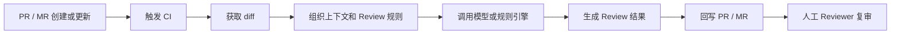
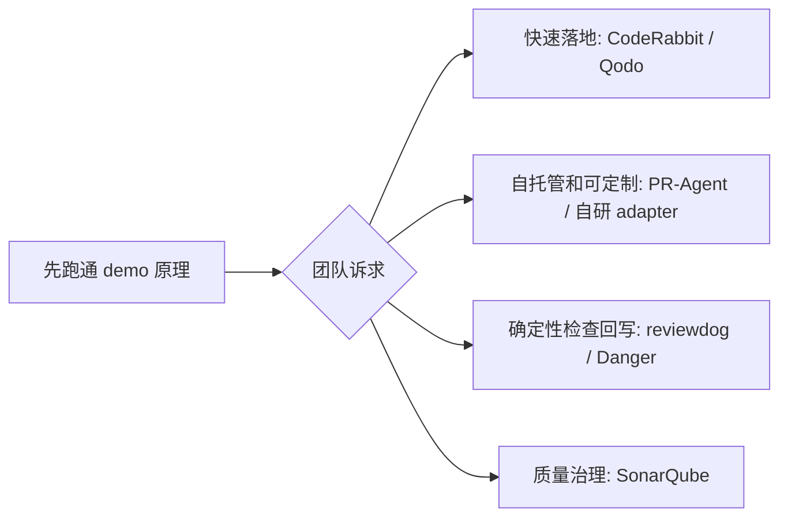
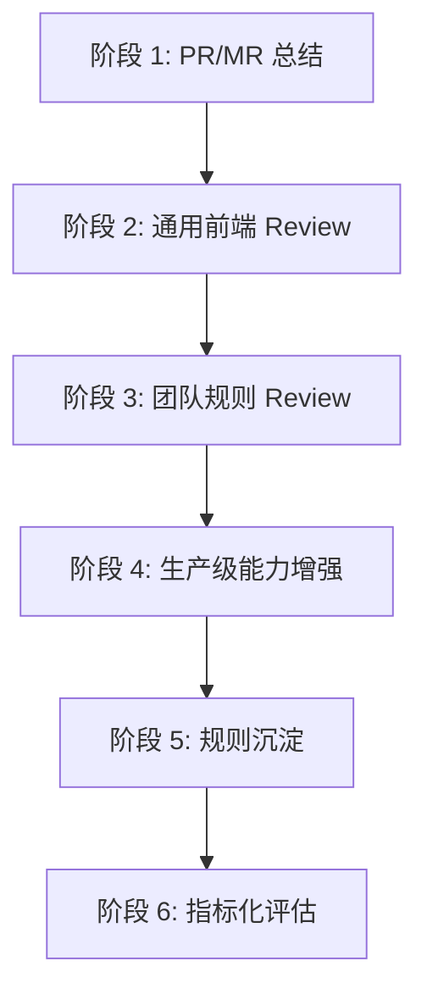

# AI Code Review 在前端项目里的落地

## 1. 分享目标

前端项目的 Code Review 经常会遇到一个矛盾：PR/MR 越来越多，组件、状态、接口、样式和工程配置交织在一起，但 Reviewer 的时间和注意力是有限的。很多问题并不是特别难，而是容易在高频交付里被漏掉，比如错误状态缺失、类型逃逸、可访问性问题、重复渲染、边界测试不足。

- 一个完整的落地链路：`diff -> prompt -> model -> review -> comment`。
- 一套可以在 GitHub、GitLab、自建 CI 中复用的实现思路。
- 一张从 demo 到生产级能力的演进路线图。

核心观点：AI Code Review 不替代人工 Review，而是成为 PR/MR 的第一轮自动审查。它先处理重复、通用、容易漏的问题，人类再处理真正需要上下文、经验和责任感的判断。

## 2. AI Code Review 的共同流程

AI Code Review 可以用现成工具，也可以自研轻量脚本，但底层基本都遵守同一条流程：

```text
触发 -> 获取 diff -> 组织上下文 -> 调用模型或规则引擎 -> 生成 Review -> 回写 PR/MR -> 人工复审
```

这条流程里，每一步都有明确职责：

- 触发：通常由 PR/MR 创建、更新、评论命令或 CI pipeline 触发。
- 获取 diff：只分析本次变更，避免把整个仓库都丢给模型。
- 组织上下文：把 diff、项目规范、相关文件、Review 规则组合成模型输入。
- 调用模型或规则引擎：可以是 GPT、Claude、公司内部模型，也可以是 SonarQube、ESLint 这类确定性工具。
- 生成 Review：输出总评、问题列表、inline comment、severity、测试建议等。
- 回写 PR/MR：把结果评论到 GitHub PR 或 GitLab MR。
- 人工复审：人类 Reviewer 判断哪些建议采纳，最终决定是否合并。



所以，CodeRabbit、Qodo PR-Agent、reviewdog、Danger JS、SonarQube，以及本 demo 的自研脚本，本质上都可以放进这条链路里。区别只是：哪些步骤由工具帮你封装好了，哪些步骤由团队自己实现。

## 3. 现成方案选型

落地 AI Code Review 有两条路：**使用现成工具**，或者**自研一套轻量流程**。

现成工具的价值是开箱即用，少写基础设施；自研方案的价值是可解释、可控、方便接入内部模型和团队规则。两条路不是互斥的：分享、POC 和底层原理讲解可以用自研 demo，生产落地可以优先评估成熟工具。

| 方案类型             | 代表工具             | 适合场景                                                  | 取舍                                             |
| -------------------- | -------------------- | --------------------------------------------------------- | ------------------------------------------------ |
| AI Code Review SaaS  | CodeRabbit、Qodo     | 想快速接入 GitHub/GitLab，少维护基础设施                  | 上手快，能力完整，但定制和数据边界取决于产品     |
| 开源 AI PR Review    | Qodo PR-Agent        | 想自托管、可改源码、可接不同模型                          | 灵活度高，但需要团队维护部署和规则               |
| 通用 Review 评论框架 | reviewdog、Danger JS | 已有 lint、test、安全扫描或自定义脚本，想把结果回写 PR/MR | 不是纯 AI，但很适合承载工具结果和自定义检查      |
| 传统质量平台         | SonarQube            | 更关注静态分析、质量门禁、安全规则和长期质量指标          | 确定性强，适合质量治理，但生成式 AI 能力不是核心 |

选型建议：

- 如果目标是快速提升 Review 体验，优先试 CodeRabbit、Qodo 这类现成 AI Review 产品。
- 如果团队希望自托管、接内部模型、深度定制规则，可以看 Qodo PR-Agent 或自研 adapter。
- 如果团队已有大量确定性工具，比如 ESLint、Stylelint、单测、安全扫描，可以用 reviewdog 或 Danger JS 把结果统一评论回 PR/MR。
- 如果团队已经在做质量门禁和代码质量治理，SonarQube 更适合作为基础质量平台，AI Review 可以作为补充。

分享时可以这样定位本 demo：

```text
现成工具解决“拿来用”的问题；
这个 demo 解决“讲清楚原理”和“验证团队定制需求”的问题。
```

也可以把工具选型和自研方案放在同一张路线图里：



## 4. 回到本 demo：每个文件负责什么

这个 demo 选择自研一套最小闭环，不是因为生产环境一定要这么写，而是为了把 AI Code Review 的关键环节拆开讲清楚。

```text
scripts/ai-review.mjs
scripts/post-review-comment.mjs
.github/workflows/ai-review.yml
.github/workflows/ci.yml
.gitlab-ci.yml
```

### 4.1 `.github/workflows/ci.yml`

这是确定性质量检查，不依赖 AI。它负责在 PR 或 push 时运行：

```bash
pnpm install --frozen-lockfile
pnpm lint
pnpm typecheck
pnpm build
```

它对应共同流程里的“基础质量门禁”。能用 TypeScript、ESLint、build 发现的问题，应该先交给确定性工具，不要浪费模型。

### 4.2 `.github/workflows/ai-review.yml`

这是 GitHub Actions 的 AI Review 接入层。它负责：

1. 在 PR 创建或更新时触发。
2. checkout 代码。
3. 根据 PR 的 base/head commit 生成 diff。
4. 调用 `pnpm ai-review` 生成 Review 内容。
5. 调用 `pnpm ai-review:comment` 把结果评论回 GitHub PR。

它对应共同流程里的：

```text
触发 -> 获取 diff -> 调用 Review 脚本 -> 回写 PR
```

### 4.3 `.gitlab-ci.yml`

这是 GitLab CI 的接入层。它和 GitHub workflow 做的是同一件事，只是换成 GitLab 的环境变量和 MR 评论方式：

1. 在 Merge Request pipeline 中触发。
2. 使用 `CI_MERGE_REQUEST_DIFF_BASE_SHA` 和 `CI_COMMIT_SHA` 生成 diff。
3. 调用 `pnpm ai-review`。
4. 设置 `AI_REVIEW_PLATFORM=gitlab`，调用 `pnpm ai-review:comment` 评论回 GitLab MR。

这说明 CI 平台不是核心，核心是中间的 Review 能力。GitHub 和 GitLab 只是不同的触发器和评论容器。

### 4.4 `scripts/ai-review.mjs`

这是 demo 的核心：平台无关的 AI Review 脚本。它负责：

1. 读取 diff，默认从 `/tmp/pr.diff` 读取，也可以通过 `PR_DIFF` 传入。
2. 组织前端 Review prompt。
3. 根据 `AI_REVIEW_PROVIDER` 选择模型 adapter。
4. 调用模型生成中文 Markdown Review。
5. 把结果写到 `/tmp/ai-review.md`。

它对应共同流程里的：

```text
组织上下文 -> 调用模型 -> 生成 Review
```

当前默认使用 OpenAI / GPT：

```text
AI_REVIEW_PROVIDER=openai
AI_REVIEW_MODEL=gpt-5-mini
OPENAI_API_KEY=sk-xxx
```

也可以切到 Claude：

```text
AI_REVIEW_PROVIDER=anthropic
AI_REVIEW_MODEL=claude-sonnet-4-5
ANTHROPIC_API_KEY=sk-ant-xxx
```

主要代码可以拆成四块讲。

第一块：读取输入和基础配置。

```js
const diffFile = process.env.AI_REVIEW_DIFF_FILE || "/tmp/pr.diff";
const outputFile = process.env.AI_REVIEW_OUTPUT_FILE || "/tmp/ai-review.md";
const provider = process.env.AI_REVIEW_PROVIDER || "openai";

const diff = await readDiff();
```

这段代码说明脚本默认从 `/tmp/pr.diff` 读取 PR/MR diff，默认把 AI Review 写到 `/tmp/ai-review.md`，默认模型 provider 是 OpenAI。

第二块：组织 Review prompt。

```js
const prompt = `
你是一名前端项目的资深 Code Reviewer，正在审查一个 Pull Request / Merge Request。

请重点关注：
- React / Next.js 代码正确性。
- TypeScript 类型安全。
- loading、empty、error 状态是否完整。
- 可访问性问题。
- 性能问题。
- 安全问题。
- 测试缺口。

代码 diff：

${diff || "(empty diff)"}
`;
```

这段是 AI Review 的核心规则：告诉模型它的角色、项目背景、检查重点和要审查的 diff。

第三块：根据 provider 选择模型 adapter。

```js
const review =
  provider === "anthropic"
    ? await reviewWithAnthropic(prompt)
    : await reviewWithOpenAI(prompt);
```

这段体现了模型适配层。CI 和 diff 逻辑不用变，只要切换 `AI_REVIEW_PROVIDER`，就可以从 GPT 切到 Claude。

第四块：调用模型并写出结果。

```js
const response = await fetch(`${baseUrl}/responses`, {
  method: "POST",
  headers: {
    Authorization: `Bearer ${apiKey}`,
    "Content-Type": "application/json",
  },
  body: JSON.stringify({
    model,
    input: prompt,
  }),
});

await writeFile(outputFile, review);
```

这段负责把 prompt 发给模型服务，并把返回的 Review 写成文件，交给后面的评论发布脚本。

### 4.5 `scripts/post-review-comment.mjs`

这是平台回写脚本。它不关心 Review 是谁生成的，只负责把 `/tmp/ai-review.md` 发回 PR/MR。

它通过环境变量判断平台：

```text
AI_REVIEW_PLATFORM=github
AI_REVIEW_PLATFORM=gitlab
```

GitHub 模式需要：

```text
GITHUB_TOKEN
GITHUB_REPOSITORY
GITHUB_PR_NUMBER
```

GitLab 模式需要：

```text
GITLAB_TOKEN
CI_PROJECT_ID
CI_MERGE_REQUEST_IID
```

它对应共同流程里的：

```text
回写 PR/MR
```

主要代码可以拆成四块讲。

第一块：读取 Review 文件并判断平台。

```js
const reviewFile = process.env.AI_REVIEW_OUTPUT_FILE || "/tmp/ai-review.md";
const platform = process.env.AI_REVIEW_PLATFORM || detectPlatform();
const body = await readFile(reviewFile, "utf8");
```

这里读取的 `/tmp/ai-review.md`，就是 `ai-review.mjs` 上一步生成的结果。

第二块：根据平台分发。

```js
if (platform === "github") {
  await postGithubComment(body);
} else if (platform === "gitlab") {
  await postGitlabComment(body);
}
```

这段说明同一份 Review 结果可以发到不同平台。平台差异被隔离在 `postGithubComment` 和 `postGitlabComment` 两个函数里。

第三块：发布 GitHub PR 评论。

```js
await postJson(`${apiUrl}/repos/${repository}/issues/${issueNumber}/comments`, {
  headers: {
    Authorization: `Bearer ${token}`,
    Accept: "application/vnd.github+json",
  },
  body: {
    body: commentBody,
  },
});
```

GitHub 的 PR 评论底层使用 issue comments API，所以这里需要 `GITHUB_TOKEN`、`GITHUB_REPOSITORY` 和 `GITHUB_PR_NUMBER`。

第四块：发布 GitLab MR 评论。

```js
await postJson(
  `${apiUrl}/projects/${encodeURIComponent(projectId)}/merge_requests/${mergeRequestIid}/notes`,
  {
    headers: {
      "PRIVATE-TOKEN": token,
    },
    body: {
      body: commentBody,
    },
  },
);
```

GitLab 的 MR 评论叫 note，所以这里调用的是 Merge Request notes API，需要 `GITLAB_TOKEN`、`CI_PROJECT_ID` 和 `CI_MERGE_REQUEST_IID`。

### 4.6 `package.json`

这里定义了本 demo 的统一命令：

```bash
pnpm ai-review
pnpm ai-review:comment
```

这样 GitHub Actions、GitLab CI、本地调试都可以复用同一套命令，而不是在每个平台的 YAML 里复制一大段逻辑。

这一节可以这样收束：

```text
CI 文件负责平台接入；
ai-review 脚本负责模型审查；
post-review-comment 脚本负责评论回写；
package.json 负责把命令统一起来。
```

## 5. GitHub 接入步骤

### 5.1 配置 Secret

在 GitHub 仓库配置：

```text
Settings -> Secrets and variables -> Actions -> New repository secret
```

必需：

```text
OPENAI_API_KEY
```

这是默认 GPT / OpenAI 模式需要的 key。

可选：

```text
AI_REVIEW_PROVIDER
AI_REVIEW_MODEL
OPENAI_BASE_URL
ANTHROPIC_API_KEY
ANTHROPIC_BASE_URL
```

如果不配置，默认使用：

```text
AI_REVIEW_PROVIDER=openai
AI_REVIEW_MODEL=gpt-5-mini
```

如果要切到 Claude，则配置：

```text
AI_REVIEW_PROVIDER=anthropic
AI_REVIEW_MODEL=claude-sonnet-4-5
ANTHROPIC_API_KEY
```

### 5.2 创建 PR

创建或更新 Pull Request 后，GitHub Actions 会触发：

```text
.github/workflows/ai-review.yml
```

流程：

1. checkout 代码。
2. 根据 PR base/head 生成 diff。
3. 调用 `pnpm ai-review` 生成 `/tmp/ai-review.md`。
4. 调用 `pnpm ai-review:comment` 评论到 PR。

GitHub 回写评论依赖默认的 `GITHUB_TOKEN`，workflow 中需要：

```yaml
permissions:
  contents: read
  pull-requests: write
```

## 6. GitLab 接入步骤

### 6.1 配置 CI/CD Variables

在 GitLab 项目配置：

```text
Settings -> CI/CD -> Variables
```

必需：

```text
GITLAB_TOKEN
```

`GITLAB_TOKEN` 需要有给 Merge Request 创建 note/comment 的权限。实际团队里建议用专门的 bot 用户 token，而不是个人主账号 token。

默认 GPT / OpenAI 模式还需要：

```text
OPENAI_API_KEY
```

如果切到 Claude，则改为：

```text
AI_REVIEW_PROVIDER=anthropic
AI_REVIEW_MODEL=claude-sonnet-4-5
ANTHROPIC_API_KEY
```

可选：

```text
AI_REVIEW_PROVIDER
AI_REVIEW_MODEL
OPENAI_BASE_URL
ANTHROPIC_API_KEY
ANTHROPIC_BASE_URL
```

### 6.2 创建 Merge Request

创建或更新 Merge Request 后，GitLab CI 会触发：

```text
.gitlab-ci.yml
```

流程：

1. 安装依赖。
2. 根据 `CI_MERGE_REQUEST_DIFF_BASE_SHA` 和 `CI_COMMIT_SHA` 生成 diff。
3. 调用 `pnpm ai-review` 生成 Review。
4. 设置 `AI_REVIEW_PLATFORM=gitlab`，调用 `pnpm ai-review:comment` 评论到 MR。

## 7. Prompt 设计

AI Review 的 Prompt 应该明确三件事：

- 项目背景：Next.js、React、TypeScript、Tailwind CSS。
- 审查重点：正确性、类型安全、状态完整性、可访问性、性能、安全、测试。
- 输出格式：中文 Markdown，区分阻塞问题和建议优化。

本项目的 Prompt 放在：

```text
scripts/ai-review.mjs
```

这比把 Prompt 写死在 CI YAML 里更好维护，也更方便后续迁移到其他平台。

## 8. 模型适配层

这个 demo 默认使用的是 OpenAI，也就是 GPT 系列模型。准确地说，`scripts/ai-review.mjs` 默认走的是 OpenAI Responses API：

```text
AI_REVIEW_PROVIDER=openai
AI_REVIEW_MODEL=gpt-5-mini
OPENAI_API_KEY=sk-xxx
```

但这个方案本身并不依赖某一个模型。真正重要的是这几个输入输出约定：

```text
输入：PR/MR diff + Review prompt
输出：Markdown review 或结构化 findings
```

只要某个模型服务能接收文本输入并返回文本结果，就可以接进来。差异主要在模型调用的 adapter 上。

### 8.1 使用 GPT / OpenAI

默认配置：

```text
AI_REVIEW_PROVIDER=openai
AI_REVIEW_MODEL=gpt-5-mini
OPENAI_API_KEY=sk-xxx
```

如果公司内部有兼容 OpenAI API 的模型网关，也可以改：

```text
AI_REVIEW_PROVIDER=openai
AI_REVIEW_MODEL=your-internal-model
OPENAI_BASE_URL=https://your-model-gateway.example.com/v1
OPENAI_API_KEY=your-gateway-key
```

这种方式适合接 OpenAI-compatible 服务，例如公司内部 LLM 网关、私有化代理或其他兼容 `/v1/responses` 的服务。

### 8.2 使用 Claude / Anthropic

Claude 的接口格式和 OpenAI 不一样，所以需要切换 provider：

```text
AI_REVIEW_PROVIDER=anthropic
AI_REVIEW_MODEL=claude-sonnet-4-5
ANTHROPIC_API_KEY=sk-ant-xxx
```

脚本里已经预留了 Anthropic Messages API 的 adapter。也就是说，CI、diff 生成、评论回写这些流程不变，只是模型调用从 OpenAI adapter 切到 Anthropic adapter。

### 8.3 接其他模型

如果要接其他模型，比如 Gemini、DeepSeek、通义、豆包或公司内部模型，一般有两种做法：

- 如果它兼容 OpenAI API：配置 `OPENAI_BASE_URL`、`AI_REVIEW_MODEL` 和对应 key。
- 如果它有自己的 API 格式：在 `scripts/ai-review.mjs` 里新增一个 provider adapter，例如 `reviewWithGemini`。

这就是为什么 demo 里把模型调用集中放在 `scripts/ai-review.mjs`，而不是散落在 GitHub Actions 或 GitLab CI YAML 里。CI 只负责触发，模型适配层负责处理不同厂商 API 的差异。

可以在分享里用这张表说明：

| 场景                      | 要改的配置                                                             | 要改的代码            |
| ------------------------- | ---------------------------------------------------------------------- | --------------------- |
| 使用默认 GPT 模型         | `OPENAI_API_KEY`                                                       | 不需要                |
| 换另一个 OpenAI 模型      | `AI_REVIEW_MODEL`                                                      | 不需要                |
| 接 OpenAI-compatible 网关 | `OPENAI_BASE_URL`、`AI_REVIEW_MODEL`、`OPENAI_API_KEY`                 | 不需要                |
| 切到 Claude               | `AI_REVIEW_PROVIDER=anthropic`、`ANTHROPIC_API_KEY`、`AI_REVIEW_MODEL` | 不需要                |
| 接非兼容 API 的模型       | 新增 provider 环境变量                                                 | 新增一个 adapter 函数 |

## 9. Demo PR 可以故意制造的问题

为了让演示效果明显，可以建一个分支：

```bash
git checkout -b feat/demo-review-issues
```

然后加入一个用户列表或订单列表页面，故意埋入这些问题：

- 列表 `key` 使用数组 index。
- 请求失败没有错误状态。
- 搜索框没有可访问 label。
- 提交按钮没有 disabled 状态，可能重复提交。
- 在 render 过程中做昂贵计算。
- 使用 `dangerouslySetInnerHTML` 渲染接口返回内容。
- 类型上使用 `any`。
- 缺少空列表展示。

预期 AI Review 能指出：

- 哪些问题可能导致真实 bug。
- 哪些问题影响可访问性。
- 哪些问题属于维护性风险。
- 哪些地方需要补测试。

## 10. CI 和 AI Review 的分工

CI 负责确定性检查：

- lint
- typecheck
- build
- test

AI Review 负责语义化检查：

- 代码意图是否合理。
- 状态分支是否完整。
- diff 是否引入维护风险。
- 是否缺少必要测试。
- 是否存在规则难以覆盖的前端体验问题。

能用 ESLint、TypeScript、单测解决的问题，优先交给确定性工具。AI 的价值在于补足规则之外的审查。

## 11. 分享演示脚本

### 开场

前端 PR 里很多问题并不是“难”，而是“容易漏”：状态分支、边界条件、可访问性、重复渲染、类型收敛、测试缺口。AI Code Review 的价值，是让这些问题在进入人工 Review 前先被扫一遍。

### 第一段：传统 Review 痛点

展示一个普通 PR：

- Reviewer 要读 diff。
- 低级问题和业务问题混在一起。
- 评论质量依赖个人经验。
- 小团队容易因为时间压力跳过细节。

### 第二段：通用 AI Review 架构

展示核心链路：

```text
diff -> prompt -> model -> markdown review -> PR/MR comment
```

强调：GitHub 和 GitLab 的差异只在“怎么拿 diff”和“怎么发评论”，中间的 AI Review 是同一套。

### 第三段：现场演示

1. 创建一个带问题的分支。
2. 提交 PR 或 MR。
3. CI 自动跑质量检查。
4. AI 自动评论。
5. 挑几条评论讲为什么有价值。
6. 修复问题后再次推送，观察 AI Review 结果变化。

### 第四段：落地边界

明确告诉大家：

- AI 不拥有最终合并权。
- AI 不能替代业务上下文判断。
- AI 输出可能误报，要由开发者和 Reviewer 判断。
- 不能把 secrets、用户隐私、敏感业务数据发给不受控模型服务。
- 对私有化要求高的团队，可以把 `OPENAI_BASE_URL` 指到公司内部模型网关。

## 12. 团队落地路线

推荐从小范围开始：

- 第一步：只做 PR/MR 总结。
- 第二步：加入通用前端 Review。
- 第三步：加入团队规范和业务规则。
- 第四步：加入 inline comment、去重、severity、文件过滤等生产级能力。
- 第五步：把高频有效评论沉淀成 ESLint、单测、组件规范。
- 第六步：统计有效评论率、误报率、Review 周期变化。



## 13. 从 Demo 到生产级的拓展能力

当前 demo 版已经跑通了核心链路：

```text
diff -> prompt -> model -> markdown review -> PR/MR comment
```

但真正进入团队生产环境，通常还需要补齐下面这些能力。

| 能力                    | 解决的问题                                 | 实现要点                                                                             | 优先级 |
| ----------------------- | ------------------------------------------ | ------------------------------------------------------------------------------------ | ------ |
| inline comment          | 总评不够精确，开发者还要自己定位代码行     | 让模型输出 `file + line + body`，再调用 GitHub/GitLab 的 review comment API          | 高     |
| 重复评论去重和更新      | 每次 push 都发一批新评论，PR/MR 会被刷屏   | 给评论加隐藏标记，例如 `<!-- ai-review:id -->`，再次运行时更新旧评论或折叠已解决评论 | 高     |
| severity 分级和阈值控制 | AI 评论轻重不分，容易干扰 Reviewer         | 输出 `blocker / major / minor / suggestion`，只把高等级问题作为阻塞                  | 高     |
| 文件过滤                | lockfile、dist、快照、生成文件会污染上下文 | 在生成 diff 前过滤文件，忽略 `pnpm-lock.yaml`、`dist/`、`.next/`、快照等             | 高     |
| 长 diff 分块            | 大 PR 超过模型上下文，或者 Review 结果太粗 | 按文件或 token 数分块 Review，再做一次 summary 合并                                  | 中     |
| repo 全局上下文检索     | 只看 diff 容易误判，缺少组件约定和调用链   | 检索相关组件、类型、工具函数、README、规范文档，一起放入上下文                       | 中     |
| 规则配置文件            | Prompt 写在脚本里，不方便团队维护          | 增加 `ai-review.config.json` 或 `ai-review.rules.md`，让不同项目配置自己的规则       | 中     |
| 安全审计和权限隔离      | token、源码、用户数据可能被过度暴露        | 最小化 token 权限，限制 secrets 读取，过滤敏感文件，必要时接内部模型网关             | 高     |
| 统计面板                | 不知道 AI Review 是否真的有效              | 统计有效评论率、误报率、采纳率、节省时间、Review 周期变化                            | 中     |

这些能力可以按优先级逐步演进，不需要第一天全部做完。分享时可以把当前 demo 定位成“最小可用闭环”，把上表定位成“生产化路线图”。

### 13.1 inline comment

demo 版现在是发一个总评，优点是实现简单，缺点是定位不够精确。生产环境里更推荐 inline comment，把问题直接挂到具体文件和代码行。

实现思路：

```json
{
  "file": "app/users/page.tsx",
  "line": 42,
  "severity": "major",
  "body": "这里使用 index 作为 key，列表重新排序时可能导致状态错位，建议使用 user.id。"
}
```

然后根据平台分别调用：

- GitHub Pull Request review comments API。
- GitLab Merge Request discussions API。

### 13.2 重复评论去重和更新

AI Review 如果每次 push 都重新发评论，很快会变成噪音。生产级做法是让每条评论有稳定身份。

常见策略：

- 根据 `file + line + issue type` 生成 fingerprint。
- 在评论里加入隐藏标记，例如 `<!-- ai-review:fingerprint=xxx -->`。
- 下一次运行时先读取历史 AI 评论。
- 已存在的问题更新评论，不重复新增。
- 已解决的问题可以标记 resolved，或者在总评里说明已消失。

这一步对团队体验影响很大，因为它决定 AI Review 是“帮忙”还是“刷屏”。

### 13.3 severity 分级和阈值控制

不是所有评论都应该阻塞合并。建议把问题分级：

- `blocker`：高概率 bug、安全风险、构建失败风险。
- `major`：重要质量问题，建议合并前修。
- `minor`：可维护性或边界体验问题。
- `suggestion`：可选优化。

团队可以设置阈值：

```text
blocker / major -> 需要处理
minor / suggestion -> 只提醒，不阻塞
```

这样 AI Review 不会变成“所有建议都必须改”的负担。

### 13.4 文件过滤

很多文件不适合交给 AI Review：

- lockfile：`pnpm-lock.yaml`、`package-lock.json`、`yarn.lock`
- 构建产物：`dist/`、`build/`、`.next/`
- 生成代码：`*.generated.ts`
- 快照文件：`*.snap`
- 大型静态资源：图片、字体、压缩文件

建议在生成 diff 前过滤。这样可以减少 token 消耗，也能提升 Review 质量。

### 13.5 长 diff 分块

大 PR 常见问题是上下文太长，模型只能给出很泛的建议。更稳的做法是分块：

1. 按文件拆分 diff。
2. 大文件继续按 hunk 或 token 数拆分。
3. 每块单独 Review。
4. 最后让模型汇总所有 findings，去重并排序。

这类能力适合中大型团队，因为大 PR 在真实项目里很常见。

### 13.6 repo 全局上下文检索

只看 diff 很容易误判。例如某个组件的约定、接口类型、错误处理模式可能定义在别处。生产级 AI Review 通常会补充仓库上下文：

- 相关组件。
- 类型定义。
- hooks 和工具函数。
- README 和编码规范。
- 相同模式的历史代码。

可以先用简单规则实现：根据 import、文件路径、符号名检索相关文件。后续再升级到向量检索或代码索引。

### 13.7 规则配置文件

当 Prompt 写在脚本里时，维护成本会慢慢变高。建议后续把规则外置：

```text
ai-review.rules.md
ai-review.config.json
```

示例配置：

```json
{
  "language": "zh-CN",
  "minSeverity": "major",
  "ignore": ["pnpm-lock.yaml", "dist/**", "*.snap"],
  "focus": ["accessibility", "performance", "type-safety", "security"]
}
```

这样不同项目可以共享脚本，但拥有自己的 Review 规则。

### 13.8 安全审计和权限隔离

AI Review 会接触源码和 diff，所以安全边界必须讲清楚：

- CI token 只给最小权限。
- 不把 `.env`、密钥、证书、私有配置送进模型。
- fork PR/MR 要谨慎处理 secrets。
- 使用 bot 账号，不使用个人 token。
- 日志里不要打印完整 prompt 和敏感 diff。
- 高敏团队可以通过 `OPENAI_BASE_URL` 或自定义 provider 接到内部模型网关。

这部分是从 demo 走向生产的前置条件，不是最后再补的细节。

### 13.9 统计面板

最后要回答一个管理问题：AI Review 到底有没有价值。

可以统计：

- 有效评论率。
- 误报率。
- 评论采纳率。
- 平均 Review 周期。
- 每个 PR/MR 节省的人工 Review 时间。
- 线上缺陷是否减少。

统计面板不一定第一期就做，但一定要在分享里提到。否则 AI Review 容易停留在“看起来很酷”，而不是可持续改进的工程能力。

## 14. 评价指标

落地后不要只看“AI 评论了多少条”，更应该看：

- 有效评论率：AI 评论中被开发者采纳的比例。
- 误报率：AI 评论中没有实际价值的比例。
- Review 周期：PR/MR 从创建到合并的平均时间。
- 缺陷前移：上线后 bug 是否减少。
- Reviewer 体验：人工 Reviewer 是否能更聚焦业务和架构。

## 15. 一句话总结

通用 AI Code Review 的关键，是把“Review 能力”从平台里抽出来：CI 只负责触发和回写，AI 脚本负责审查逻辑。这样 GitHub 能用，GitLab 也能用，未来换模型或接内部网关也能继续用。

## 16. 参考资料

- CodeRabbit Docs: https://docs.coderabbit.ai/
- Qodo PR-Agent Docs: https://qodo-merge-docs.qodo.ai/
- reviewdog: https://github.com/reviewdog/reviewdog
- Danger JS: https://danger.systems/js/
- SonarQube Pull Request Analysis: https://docs.sonarsource.com/sonarqube-server/analyzing-source-code/pull-request-analysis/introduction/
- GitHub Actions workflow syntax: https://docs.github.com/en/actions/reference/workflows-and-actions/workflow-syntax
- GitHub REST API issue comments: https://docs.github.com/en/rest/issues/comments
- GitLab Merge Request notes API: https://docs.gitlab.com/api/notes/
- GitLab predefined CI/CD variables: https://docs.gitlab.com/ci/variables/predefined_variables/
- OpenAI API quickstart: https://platform.openai.com/docs/quickstart/make-your-first-api-request
- Anthropic Messages API: https://docs.anthropic.com/en/api/messages
